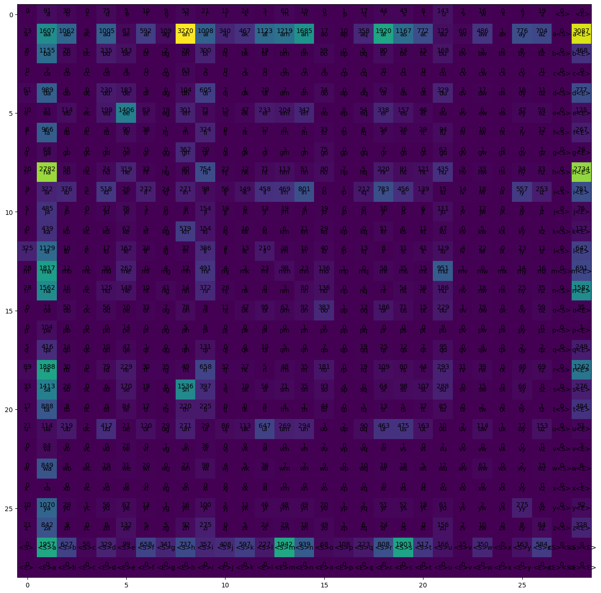
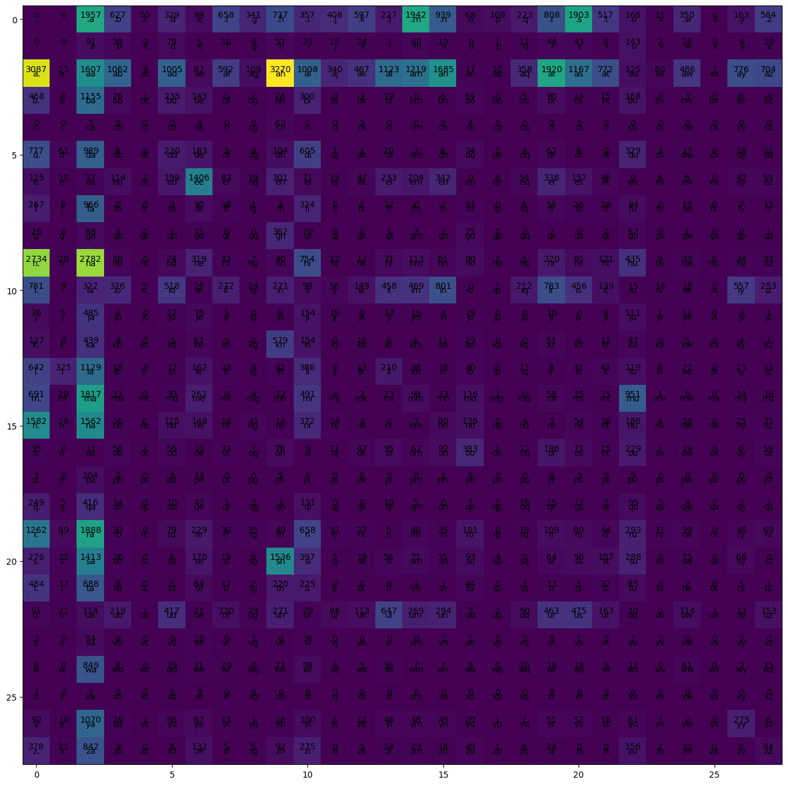
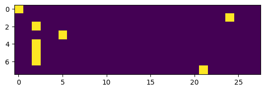

<div style="display: flex;">
  
  
</div>


### About the Project

The project involves working with a dataset of Muslim names to analyze
and generate new names. Techniques such as preprocessing, bi-gram
modeling, encoding/decoding, probability calculations, and neural
network modeling are used. The project aims to explore patterns, predict
next characters, calculate likelihoods, and generate new names using the
trained model.

### Dataset Description

The Muslim Names dataset is a comprehensive collection of names commonly
used among Muslims worldwide. This dataset consists of over 15,000
unique Muslim names, making it a valuable resource for various
applications such as research, data analysis, and cultural studies.

| Dataset Name | Default task                               | Download link                                                                    |
|:-------------|:-------------------------------------------|:---------------------------------------------------------------------------------|
| Muslim Names | Neural Network Prediction / Classification | <https://raw.githubusercontent.com/ubisoc/muslim-names-crawler/master/names.txt> |

</div>

<div class="cell markdown">

#### Loading and preprocessing data

</div>

<div class="cell code" execution_count="6">

``` python
words = open('names.txt').read().splitlines()

# remove duplicates
words = list(set(words))

# remove words with non-ascii characters
words = [w for w in words if w.isascii()]

# remove .
words = [w for w in words if '.' not in w]

# lowercase
words = [w.lower() for w in words]

# jiggle the list
import random
random.shuffle(words)


words[:10]
```

<div class="output execute_result" execution_count="6">

    ['wadaaat',
     'iqwaan',
     'golestan',
     'raika',
     'muin ud deen',
     'nevaeh',
     'pareerokh',
     'zurafaa',
     'shukri',
     'shaeef']

</div>

</div>

<div class="cell code" execution_count="7">

``` python
len(words)
```

<div class="output execute_result" execution_count="7">

    14173

</div>

</div>

<div class="cell code" execution_count="8">

``` python
print(min([len(w) for w in words]), max([len(w) for w in words]))
```

<div class="output stream stdout">

    2 20

</div>

</div>

<div class="cell markdown">

#### Bi-Gram Model with start and end token different

</div>

<div class="cell code" execution_count="9">

``` python
b = {}
for w in words:
    chs = ['<S>'] + list(w) + ['<E>']
    for ch1, ch2 in zip(chs, chs[1:]):
        bigram = (ch1, ch2)
        b[bigram] = b.get(bigram, 0) + 1
```

</div>

<div class="cell code" execution_count="10">

``` python
# sort b by frequency
b = sorted(b.items(), key=lambda x: x[1], reverse=True)
b[:10]
```

<div class="output execute_result" execution_count="10">

    [(('a', 'h'), 3270),
     (('a', '<E>'), 3087),
     (('h', 'a'), 2782),
     (('h', '<E>'), 2734),
     (('<S>', 'a'), 1957),
     (('<S>', 'm'), 1942),
     (('a', 'r'), 1920),
     (('<S>', 's'), 1903),
     (('r', 'a'), 1888),
     (('m', 'a'), 1817)]

</div>

</div>

<div class="cell markdown">

#### Encoding and Decoding the data

</div>

<div class="cell code" execution_count="11">

``` python
chars = sorted(list(set(''.join(words))))

encode = {c: i for i, c in enumerate(chars)}
encode['<S>'] = 27
encode['<E>'] = 28

decode = {i: c for c, i in encode.items()}
```

</div>

<div class="cell code" execution_count="12">

``` python
# create numpy array of zero 29x29 matrix
import numpy as np
N = np.zeros((29, 29), dtype=np.int32)
```

</div>

<div class="cell markdown">

#### Using Counting method to find the probability of the next word

</div>

<div class="cell code" execution_count="13">

``` python
for w in words:
    chs = ['<S>'] + list(w) + ['<E>']
    for ch1, ch2 in zip(chs, chs[1:]):
        ix1 = encode[ch1]
        ix2 = encode[ch2]
        N[ix1, ix2] += 1
```

</div>

<div class="cell code" execution_count="14">

``` python
import matplotlib.pyplot as plt

plt.figure(figsize=(16, 16))
plt.imshow(N)

for i in range(29):
    for j in range(29):
        chs = decode[i] + decode[j]
        plt.text(j, i, chs, ha='center', va='center')
        plt.text(j, i, N[i, j], ha='center', va='bottom')
```

<div class="output display_data">



</div>

</div>

<div class="cell markdown">

#### Choosing the start and end token same i.e., a dot '.' (Reason we did this because the previous model last row is zero and so on etc.)

</div>

<div class="cell code" execution_count="15">

``` python
chars = sorted(list(set(''.join(words))))

encode = {c: i+1 for i, c in enumerate(chars)}
encode['.'] = 0

decode = {i: c for c, i in encode.items()}
# create numpy array of zero 29x29 matrix
import numpy as np
N = np.zeros((28,28), dtype=np.int32)
for w in words:
    chs = ['.'] + list(w) + ['.']
    for ch1, ch2 in zip(chs, chs[1:]):
        ix1 = encode[ch1]
        ix2 = encode[ch2]
        N[ix1, ix2] += 1
import matplotlib.pyplot as plt

plt.figure(figsize=(16, 40))
plt.imshow(N)

for i in range(28):
    for j in range(28):
        chs = decode[i] + decode[j]
        plt.text(j, i, chs, ha='center', va='center')
        plt.text(j, i, N[i, j], ha='center', va='bottom')
```

<div class="output display_data">



</div>

</div>

<div class="cell markdown">

#### Using Probabilities

</div>

<div class="cell code" execution_count="16">

``` python
import torch

N = torch.tensor(N, dtype=torch.float32)
```

</div>

<div class="cell code" execution_count="17">

``` python
p = N[0]
p = p / p.sum()
p
```

<div class="output execute_result" execution_count="17">

    tensor([0.0000, 0.0000, 0.1381, 0.0442, 0.0035, 0.0232, 0.0070, 0.0464, 0.0241,
            0.0520, 0.0252, 0.0288, 0.0421, 0.0160, 0.1370, 0.0663, 0.0048, 0.0076,
            0.0157, 0.0570, 0.1343, 0.0365, 0.0117, 0.0011, 0.0247, 0.0000, 0.0115,
            0.0412])

</div>

</div>

<div class="cell code" execution_count="18">

``` python
g = torch.Generator().manual_seed(0)
ix = torch.multinomial(p, 1, replacement=True, generator=g).item()

decode[ix]
```

<div class="output execute_result" execution_count="18">

    'a'

</div>

</div>

<div class="cell markdown">

#### Using Miltinomial Distrubtion of PyTorch to find the next word

</div>

<div class="cell code" execution_count="19">

``` python
g = torch.Generator().manual_seed(0)


for i in range(20):
    out = []

    ix = 0
    while True:
        p = N[ix]
        p = p / p.sum()
        ix = torch.multinomial(p, 1, replacement=True, generator=g).item()
        out.append(decode[ix])
        if ix == 0:
            break
    print(''.join(out))    
```

<div class="output stream stdout">

    asemadub.
    beeen.
    d.
    kh.
    kal.
    nnushilisug.
    mata.
    maabdqranizul.
    pasazyat.
    jin.
    kabraeeyyrar.
    r.
    shaanafahanuraharur.
    f.
    rismna.
    raai.
    shakilah.
    kil.
    lyahriseba.
    m.

</div>

</div>

<div class="cell markdown">

#### Shortening the previous code inside while loop

</div>

<div class="cell code" execution_count="20">

``` python
P = N / N.sum(dim=1, keepdims=True)

g = torch.Generator().manual_seed(0)


for i in range(20):
    out = []

    ix = 0
    while True:
        p = P[ix]
        ix = torch.multinomial(p, 1, replacement=True, generator=g).item()
        out.append(decode[ix])
        if ix == 0:
            break
    print(''.join(out))    
```

<div class="output stream stdout">

    asemadub.
    beeen.
    d.
    kh.
    kal.
    nnushilisug.
    mata.
    maabdqranizul.
    pasazyat.
    jin.
    kabraeeyyrar.
    r.
    shaanafahanuraharur.
    f.
    rismna.
    raai.
    shakilah.
    kil.
    lyahriseba.
    m.

</div>

</div>

<div class="cell markdown">

#### Caclulating log likelihood, perplexity (Average Log likelihood) and negative log likelihood

</div>

<div class="cell code" execution_count="21">

``` python
log_likelihood = 0
n = 0
for w in words:
    chs = ['.'] + list(w) + ['.']
    for ch1, ch2 in zip(chs, chs[1:]):
        ix1 = encode[ch1]
        ix2 = encode[ch2]
        p = P[ix1,ix2]
        logp = torch.log(p)
        log_likelihood += logp
        n += 1
        # print(f'{ch1} -> {ch2} : {p:.3f} {logp:.3f}')

print(f'log likelihood: {log_likelihood:.3f}')
negation = -log_likelihood
print(f'negation: {negation:.3f}')
print(f'perplexity: {negation/n:.3f}')
```

<div class="output stream stdout">

    log likelihood: -250851.922
    negation: 250851.922
    perplexity: 2.357

</div>

</div>

<div class="cell markdown">

#### Model Smoothing because some count are zero so adding one to them

</div>

<div class="cell code" execution_count="22">

``` python
# Model smoothing
P = N+1
P = P / P.sum(dim=1, keepdims=True)
log_likelihood = 0
n = 0
for w in words:
    chs = ['.'] + list(w) + ['.']
    for ch1, ch2 in zip(chs, chs[1:]):
        ix1 = encode[ch1]
        ix2 = encode[ch2]
        p = P[ix1,ix2]
        logp = torch.log(p)
        log_likelihood += logp
        n += 1
        # print(f'{ch1} -> {ch2} : {p:.3f} {logp:.3f}')

print(f'log likelihood: {log_likelihood:.3f}')
negation = -log_likelihood
print(f'negation: {negation:.3f}')
print(f'perplexity: {negation/n:.3f}')
```

<div class="output stream stdout">

    log likelihood: -251026.828
    negation: 251026.828
    perplexity: 2.359

</div>

</div>

<div class="cell markdown">

#### Neural Network Model (Training and testing data) - For single word

</div>

<div class="cell code" execution_count="23">

``` python
# create the training data
xs = []
ys = []
for w in words[:1]:
    chs = ['.'] + list(w) + ['.']
    for ch1, ch2 in zip(chs, chs[1:]):
        ix1 = encode[ch1]
        ix2 = encode[ch2]
        xs.append(ix1)
        ys.append(ix2)
        print(f'{ch1} -> {ch2} : {ix1} {ix2}')

xs = torch.tensor(xs)
ys = torch.tensor(ys)
```

<div class="output stream stdout">

    . -> w : 0 24
    w -> a : 24 2
    a -> d : 2 5
    d -> a : 5 2
    a -> a : 2 2
    a -> a : 2 2
    a -> t : 2 21
    t -> . : 21 0

</div>

</div>

<div class="cell code" execution_count="24">

``` python
print(xs)
print(ys)
```

<div class="output stream stdout">

    tensor([ 0, 24,  2,  5,  2,  2,  2, 21])
    tensor([24,  2,  5,  2,  2,  2, 21,  0])

</div>

</div>

<div class="cell markdown">

#### One hot Encoding

</div>

<div class="cell code" execution_count="25">

``` python
# one-hot encoding
import torch.nn.functional as F
Xenc = F.one_hot(xs, num_classes=28).float()
Xenc
```

<div class="output execute_result" execution_count="25">

    tensor([[1., 0., 0., 0., 0., 0., 0., 0., 0., 0., 0., 0., 0., 0., 0., 0., 0., 0.,
             0., 0., 0., 0., 0., 0., 0., 0., 0., 0.],
            [0., 0., 0., 0., 0., 0., 0., 0., 0., 0., 0., 0., 0., 0., 0., 0., 0., 0.,
             0., 0., 0., 0., 0., 0., 1., 0., 0., 0.],
            [0., 0., 1., 0., 0., 0., 0., 0., 0., 0., 0., 0., 0., 0., 0., 0., 0., 0.,
             0., 0., 0., 0., 0., 0., 0., 0., 0., 0.],
            [0., 0., 0., 0., 0., 1., 0., 0., 0., 0., 0., 0., 0., 0., 0., 0., 0., 0.,
             0., 0., 0., 0., 0., 0., 0., 0., 0., 0.],
            [0., 0., 1., 0., 0., 0., 0., 0., 0., 0., 0., 0., 0., 0., 0., 0., 0., 0.,
             0., 0., 0., 0., 0., 0., 0., 0., 0., 0.],
            [0., 0., 1., 0., 0., 0., 0., 0., 0., 0., 0., 0., 0., 0., 0., 0., 0., 0.,
             0., 0., 0., 0., 0., 0., 0., 0., 0., 0.],
            [0., 0., 1., 0., 0., 0., 0., 0., 0., 0., 0., 0., 0., 0., 0., 0., 0., 0.,
             0., 0., 0., 0., 0., 0., 0., 0., 0., 0.],
            [0., 0., 0., 0., 0., 0., 0., 0., 0., 0., 0., 0., 0., 0., 0., 0., 0., 0.,
             0., 0., 0., 1., 0., 0., 0., 0., 0., 0.]])

</div>

</div>

<div class="cell markdown">

#### Viusalization the one hot encoding


</div>

<div class="cell code" execution_count="26">

``` python
plt.imshow(Xenc)
```




<div class="output display_data">


</div>

</div>

<div class="cell code" execution_count="27">

``` python
print(Xenc.dtype, Xenc.shape)
```

<div class="output stream stdout">

    torch.float32 torch.Size([8, 28])

</div>

</div>

<div class="cell markdown">

#### Applying the weights formula (Multiplying weights with one hot encoding)

</div>

<div class="cell code" execution_count="28">

``` python
W = torch.randn(28, 28, requires_grad=True)
Xenc @ W 
```

<div class="output execute_result" execution_count="28">

    tensor([[ 1.0203,  0.7492,  1.3796,  0.2773, -0.6036,  0.9250, -0.7373, -0.5836,
              1.4788, -0.0742,  0.1543, -0.3717, -1.6123, -1.0485,  0.4134,  1.1113,
             -0.4612, -0.6797,  0.8336,  1.3853,  0.3103,  0.0730, -1.2376,  0.8864,
              1.6588,  0.7886,  1.4157, -0.5014],
            [-0.9133,  0.5811, -0.4396,  0.6401, -0.1496,  2.1366,  1.5079, -0.5376,
              0.1116,  1.3113,  0.3652, -2.0303, -0.8769,  2.4117,  2.2523, -0.3574,
              2.2500,  0.1895, -0.2344, -1.3399,  0.4000, -0.1423,  0.2707, -0.9239,
              0.1701,  1.0391, -0.1906,  0.8043],
            [ 1.2310, -0.5574, -0.1442,  0.1162,  0.4534,  2.4869,  0.3072, -0.6016,
             -1.1211, -0.0114, -0.3969, -0.0229,  0.3223,  0.4573, -1.0818, -0.4615,
              1.0137, -0.2427, -1.3539,  0.0488, -1.1617,  0.8978,  0.7549,  1.5667,
             -0.2215, -0.7726, -0.2353, -0.5221],
            [ 1.1506, -1.5700,  0.1345,  0.2435,  0.4281,  0.3866, -0.4950, -0.2020,
             -0.0418, -0.1704, -0.9109,  1.8605, -0.6269,  0.1065, -0.7218, -0.6415,
              1.0598, -1.5088,  0.3427,  0.5848,  0.4706,  0.9978, -1.1046, -0.3873,
              0.9040, -0.5086,  0.3672,  1.2723],
            [ 1.2310, -0.5574, -0.1442,  0.1162,  0.4534,  2.4869,  0.3072, -0.6016,
             -1.1211, -0.0114, -0.3969, -0.0229,  0.3223,  0.4573, -1.0818, -0.4615,
              1.0137, -0.2427, -1.3539,  0.0488, -1.1617,  0.8978,  0.7549,  1.5667,
             -0.2215, -0.7726, -0.2353, -0.5221],
            [ 1.2310, -0.5574, -0.1442,  0.1162,  0.4534,  2.4869,  0.3072, -0.6016,
             -1.1211, -0.0114, -0.3969, -0.0229,  0.3223,  0.4573, -1.0818, -0.4615,
              1.0137, -0.2427, -1.3539,  0.0488, -1.1617,  0.8978,  0.7549,  1.5667,
             -0.2215, -0.7726, -0.2353, -0.5221],
            [ 1.2310, -0.5574, -0.1442,  0.1162,  0.4534,  2.4869,  0.3072, -0.6016,
             -1.1211, -0.0114, -0.3969, -0.0229,  0.3223,  0.4573, -1.0818, -0.4615,
              1.0137, -0.2427, -1.3539,  0.0488, -1.1617,  0.8978,  0.7549,  1.5667,
             -0.2215, -0.7726, -0.2353, -0.5221],
            [-1.0619,  0.3810,  0.8300, -0.7392, -1.0751, -0.2149, -0.8042,  1.1411,
             -0.4606,  1.3808,  0.9255, -0.5336,  0.3797,  1.8135,  1.5453,  0.1123,
              0.5833, -0.2571,  0.8641, -0.9613,  0.2108,  0.7699, -0.7242,  1.6133,
              0.7618,  1.5655, -0.0852, -1.6688]], grad_fn=<MmBackward0>)

</div>

</div>

<div class="cell code" execution_count="29">

``` python
logits = Xenc @ W
logits.shape
```

<div class="output execute_result" execution_count="29">

    torch.Size([8, 28])

</div>

</div>

<div class="cell markdown">

#### Softmax

</div>

<div class="cell code" execution_count="30">

``` python
counts = logits.exp()
```

</div>

<div class="cell code" execution_count="31">

``` python
prob = counts / counts.sum(dim=1, keepdims=True)
prob
```

<div class="output execute_result" execution_count="31">

    tensor([[0.0540, 0.0412, 0.0774, 0.0257, 0.0107, 0.0491, 0.0093, 0.0109, 0.0855,
             0.0181, 0.0227, 0.0134, 0.0039, 0.0068, 0.0295, 0.0592, 0.0123, 0.0099,
             0.0448, 0.0779, 0.0266, 0.0210, 0.0057, 0.0473, 0.1023, 0.0429, 0.0803,
             0.0118],
            [0.0057, 0.0255, 0.0092, 0.0270, 0.0123, 0.1206, 0.0643, 0.0083, 0.0159,
             0.0528, 0.0205, 0.0019, 0.0059, 0.1588, 0.1354, 0.0100, 0.1351, 0.0172,
             0.0113, 0.0037, 0.0212, 0.0123, 0.0187, 0.0057, 0.0169, 0.0402, 0.0118,
             0.0318],
            [0.0752, 0.0126, 0.0190, 0.0247, 0.0345, 0.2639, 0.0298, 0.0120, 0.0072,
             0.0217, 0.0148, 0.0214, 0.0303, 0.0347, 0.0074, 0.0138, 0.0605, 0.0172,
             0.0057, 0.0230, 0.0069, 0.0539, 0.0467, 0.1051, 0.0176, 0.0101, 0.0173,
             0.0130],
            [0.0767, 0.0050, 0.0277, 0.0309, 0.0372, 0.0357, 0.0148, 0.0198, 0.0233,
             0.0205, 0.0098, 0.1559, 0.0130, 0.0270, 0.0118, 0.0128, 0.0700, 0.0054,
             0.0342, 0.0435, 0.0388, 0.0658, 0.0080, 0.0165, 0.0599, 0.0146, 0.0350,
             0.0866],
            [0.0752, 0.0126, 0.0190, 0.0247, 0.0345, 0.2639, 0.0298, 0.0120, 0.0072,
             0.0217, 0.0148, 0.0214, 0.0303, 0.0347, 0.0074, 0.0138, 0.0605, 0.0172,
             0.0057, 0.0230, 0.0069, 0.0539, 0.0467, 0.1051, 0.0176, 0.0101, 0.0173,
             0.0130],
            [0.0752, 0.0126, 0.0190, 0.0247, 0.0345, 0.2639, 0.0298, 0.0120, 0.0072,
             0.0217, 0.0148, 0.0214, 0.0303, 0.0347, 0.0074, 0.0138, 0.0605, 0.0172,
             0.0057, 0.0230, 0.0069, 0.0539, 0.0467, 0.1051, 0.0176, 0.0101, 0.0173,
             0.0130],
            [0.0752, 0.0126, 0.0190, 0.0247, 0.0345, 0.2639, 0.0298, 0.0120, 0.0072,
             0.0217, 0.0148, 0.0214, 0.0303, 0.0347, 0.0074, 0.0138, 0.0605, 0.0172,
             0.0057, 0.0230, 0.0069, 0.0539, 0.0467, 0.1051, 0.0176, 0.0101, 0.0173,
             0.0130],
            [0.0066, 0.0278, 0.0435, 0.0091, 0.0065, 0.0153, 0.0085, 0.0594, 0.0120,
             0.0755, 0.0479, 0.0111, 0.0278, 0.1164, 0.0890, 0.0212, 0.0340, 0.0147,
             0.0450, 0.0073, 0.0234, 0.0410, 0.0092, 0.0953, 0.0407, 0.0908, 0.0174,
             0.0036]], grad_fn=<DivBackward0>)

</div>

</div>

<div class="cell code" execution_count="32">

``` python
prob[0].sum()
```

<div class="output execute_result" execution_count="32">

    tensor(1.0000, grad_fn=<SumBackward0>)

</div>

</div>

<div class="cell markdown">

#### log likelihood, negative log likelihood for single word

</div>

<div class="cell code" execution_count="33">

``` python
nlls = torch.zeros(7)
for i in range(7):
  # i-th bigram:
  x = xs[i].item() # input character index
  y = ys[i].item() # label character index
  print('--------')
  print(f'bigram example {i+1}: {decode[x]}{decode[y]} (indexes {x},{y})')
  print('input to the neural net:', x)
  print('output probabilities from the neural net:', prob[i])
  print('label (actual next character):', y)
  p = prob[i, y]
  print('probability assigned by the net to the the correct character:', p.item())
  logp = torch.log(p)
  print('log likelihood:', logp.item())
  nll = -logp
  print('negative log likelihood:', nll.item())
  nlls[i] = nll

print('=========')
print('average negative log likelihood, i.e. loss =', nlls.mean().item())
```

<div class="output stream stdout">

    --------
    bigram example 1: .w (indexes 0,24)
    input to the neural net: 0
    output probabilities from the neural net: tensor([0.0540, 0.0412, 0.0774, 0.0257, 0.0107, 0.0491, 0.0093, 0.0109, 0.0855,
            0.0181, 0.0227, 0.0134, 0.0039, 0.0068, 0.0295, 0.0592, 0.0123, 0.0099,
            0.0448, 0.0779, 0.0266, 0.0210, 0.0057, 0.0473, 0.1023, 0.0429, 0.0803,
            0.0118], grad_fn=<SelectBackward0>)
    label (actual next character): 24
    probability assigned by the net to the the correct character: 0.10234204679727554
    log likelihood: -2.2794346809387207
    negative log likelihood: 2.2794346809387207
    --------
    bigram example 2: wa (indexes 24,2)
    input to the neural net: 24
    output probabilities from the neural net: tensor([0.0057, 0.0255, 0.0092, 0.0270, 0.0123, 0.1206, 0.0643, 0.0083, 0.0159,
            0.0528, 0.0205, 0.0019, 0.0059, 0.1588, 0.1354, 0.0100, 0.1351, 0.0172,
            0.0113, 0.0037, 0.0212, 0.0123, 0.0187, 0.0057, 0.0169, 0.0402, 0.0118,
            0.0318], grad_fn=<SelectBackward0>)
    label (actual next character): 2
    probability assigned by the net to the the correct character: 0.009174077771604061
    log likelihood: -4.691373348236084
    negative log likelihood: 4.691373348236084
    --------
    bigram example 3: ad (indexes 2,5)
    input to the neural net: 2
    output probabilities from the neural net: tensor([0.0752, 0.0126, 0.0190, 0.0247, 0.0345, 0.2639, 0.0298, 0.0120, 0.0072,
            0.0217, 0.0148, 0.0214, 0.0303, 0.0347, 0.0074, 0.0138, 0.0605, 0.0172,
            0.0057, 0.0230, 0.0069, 0.0539, 0.0467, 0.1051, 0.0176, 0.0101, 0.0173,
            0.0130], grad_fn=<SelectBackward0>)
    label (actual next character): 5
    probability assigned by the net to the the correct character: 0.26388201117515564
    log likelihood: -1.3322532176971436
    negative log likelihood: 1.3322532176971436
    --------
    bigram example 4: da (indexes 5,2)
    input to the neural net: 5
    output probabilities from the neural net: tensor([0.0767, 0.0050, 0.0277, 0.0309, 0.0372, 0.0357, 0.0148, 0.0198, 0.0233,
            0.0205, 0.0098, 0.1559, 0.0130, 0.0270, 0.0118, 0.0128, 0.0700, 0.0054,
            0.0342, 0.0435, 0.0388, 0.0658, 0.0080, 0.0165, 0.0599, 0.0146, 0.0350,
            0.0866], grad_fn=<SelectBackward0>)
    label (actual next character): 2
    probability assigned by the net to the the correct character: 0.02774767391383648
    log likelihood: -3.5846033096313477
    negative log likelihood: 3.5846033096313477
    --------
    bigram example 5: aa (indexes 2,2)
    input to the neural net: 2
    output probabilities from the neural net: tensor([0.0752, 0.0126, 0.0190, 0.0247, 0.0345, 0.2639, 0.0298, 0.0120, 0.0072,
            0.0217, 0.0148, 0.0214, 0.0303, 0.0347, 0.0074, 0.0138, 0.0605, 0.0172,
            0.0057, 0.0230, 0.0069, 0.0539, 0.0467, 0.1051, 0.0176, 0.0101, 0.0173,
            0.0130], grad_fn=<SelectBackward0>)
    label (actual next character): 2
    probability assigned by the net to the the correct character: 0.018999138846993446
    log likelihood: -3.9633617401123047
    negative log likelihood: 3.9633617401123047
    --------
    bigram example 6: aa (indexes 2,2)
    input to the neural net: 2
    output probabilities from the neural net: tensor([0.0752, 0.0126, 0.0190, 0.0247, 0.0345, 0.2639, 0.0298, 0.0120, 0.0072,
            0.0217, 0.0148, 0.0214, 0.0303, 0.0347, 0.0074, 0.0138, 0.0605, 0.0172,
            0.0057, 0.0230, 0.0069, 0.0539, 0.0467, 0.1051, 0.0176, 0.0101, 0.0173,
            0.0130], grad_fn=<SelectBackward0>)
    label (actual next character): 2
    probability assigned by the net to the the correct character: 0.018999138846993446
    log likelihood: -3.9633617401123047
    negative log likelihood: 3.9633617401123047
    --------
    bigram example 7: at (indexes 2,21)
    input to the neural net: 2
    output probabilities from the neural net: tensor([0.0752, 0.0126, 0.0190, 0.0247, 0.0345, 0.2639, 0.0298, 0.0120, 0.0072,
            0.0217, 0.0148, 0.0214, 0.0303, 0.0347, 0.0074, 0.0138, 0.0605, 0.0172,
            0.0057, 0.0230, 0.0069, 0.0539, 0.0467, 0.1051, 0.0176, 0.0101, 0.0173,
            0.0130], grad_fn=<SelectBackward0>)
    label (actual next character): 21
    probability assigned by the net to the the correct character: 0.05385924130678177
    log likelihood: -2.9213812351226807
    negative log likelihood: 2.9213812351226807
    =========
    average negative log likelihood, i.e. loss = 3.247966766357422

</div>

</div>

<div class="cell markdown">

#### Back Propogation

</div>

<div class="cell code" execution_count="34">

``` python
# one-hot encoding
Xenc = F.one_hot(xs, num_classes=28).float()
logits = Xenc @ W
counts = logits.exp()
prob = counts / counts.sum(dim=1, keepdims=True)
prob[0]
```

<div class="output execute_result" execution_count="34">

    tensor([0.0540, 0.0412, 0.0774, 0.0257, 0.0107, 0.0491, 0.0093, 0.0109, 0.0855,
            0.0181, 0.0227, 0.0134, 0.0039, 0.0068, 0.0295, 0.0592, 0.0123, 0.0099,
            0.0448, 0.0779, 0.0266, 0.0210, 0.0057, 0.0473, 0.1023, 0.0429, 0.0803,
            0.0118], grad_fn=<SelectBackward0>)

</div>

</div>

<div class="cell code" execution_count="35">

``` python
print(xs, ys)
```

<div class="output stream stdout">

    tensor([ 0, 24,  2,  5,  2,  2,  2, 21]) tensor([24,  2,  5,  2,  2,  2, 21,  0])

</div>

</div>

<div class="cell code" execution_count="36">

``` python
prob[0, ys[0]], prob[1, ys[1]], prob[2, ys[2]], prob[3, ys[3]], prob[4, ys[4]], prob[5, ys[5]], prob[6, ys[6]]
```

<div class="output execute_result" execution_count="36">

    (tensor(0.1023, grad_fn=<SelectBackward0>),
     tensor(0.0092, grad_fn=<SelectBackward0>),
     tensor(0.2639, grad_fn=<SelectBackward0>),
     tensor(0.0277, grad_fn=<SelectBackward0>),
     tensor(0.0190, grad_fn=<SelectBackward0>),
     tensor(0.0190, grad_fn=<SelectBackward0>),
     tensor(0.0539, grad_fn=<SelectBackward0>))

</div>

</div>

<div class="cell code" execution_count="37">

``` python
torch.arange(7)
```

<div class="output execute_result" execution_count="37">

    tensor([0, 1, 2, 3, 4, 5, 6])

</div>

</div>

<div class="cell code">

``` python
loss = -prob[torch.arange(7), ys].log().mean()
loss
```

</div>

<div class="cell code">

``` python
# backward pass
W.grad = None
loss.backward()
```

</div>

<div class="cell code">

``` python
W.grad
```

<div class="output execute_result" execution_count="68">

    tensor([[ 0.0057,  0.0027,  0.0006,  0.0056,  0.0058,  0.0129,  0.0117,  0.0027,
              0.0061,  0.0021,  0.0016,  0.0005,  0.0090,  0.0049,  0.0041,  0.0026,
              0.0028,  0.0067,  0.0011,  0.0120,  0.0016, -0.1389,  0.0025,  0.0066,
              0.0052,  0.0091,  0.0078,  0.0049],
            [ 0.0000,  0.0000,  0.0000,  0.0000,  0.0000,  0.0000,  0.0000,  0.0000,
              0.0000,  0.0000,  0.0000,  0.0000,  0.0000,  0.0000,  0.0000,  0.0000,
              0.0000,  0.0000,  0.0000,  0.0000,  0.0000,  0.0000,  0.0000,  0.0000,
              0.0000,  0.0000,  0.0000,  0.0000],
            [ 0.0172,  0.0014,  0.0115,  0.0196,  0.0015, -0.1178,  0.0033,  0.0179,
              0.0191,  0.0037,  0.0014,  0.0087,  0.0310,  0.0020,  0.0046,  0.0200,
              0.0106,  0.0081,  0.0128,  0.0070,  0.0004,  0.0093,  0.0028,  0.0029,
             -0.1399,  0.0352,  0.0045,  0.0010],
            [ 0.0000,  0.0000,  0.0000,  0.0000,  0.0000,  0.0000,  0.0000,  0.0000,
              0.0000,  0.0000,  0.0000,  0.0000,  0.0000,  0.0000,  0.0000,  0.0000,
              0.0000,  0.0000,  0.0000,  0.0000,  0.0000,  0.0000,  0.0000,  0.0000,
              0.0000,  0.0000,  0.0000,  0.0000],
            [ 0.0000,  0.0000,  0.0000,  0.0000,  0.0000,  0.0000,  0.0000,  0.0000,
              0.0000,  0.0000,  0.0000,  0.0000,  0.0000,  0.0000,  0.0000,  0.0000,
              0.0000,  0.0000,  0.0000,  0.0000,  0.0000,  0.0000,  0.0000,  0.0000,
              0.0000,  0.0000,  0.0000,  0.0000],
            [-0.1382,  0.0040,  0.0045,  0.0022,  0.0028,  0.0023,  0.0072,  0.0020,
              0.0030,  0.0017,  0.0103,  0.0023,  0.0033,  0.0009,  0.0051,  0.0046,
              0.0010,  0.0159,  0.0117,  0.0009,  0.0042,  0.0003,  0.0027,  0.0125,
              0.0079,  0.0176,  0.0037,  0.0038],
            [ 0.0000,  0.0000,  0.0000,  0.0000,  0.0000,  0.0000,  0.0000,  0.0000,
              0.0000,  0.0000,  0.0000,  0.0000,  0.0000,  0.0000,  0.0000,  0.0000,
              0.0000,  0.0000,  0.0000,  0.0000,  0.0000,  0.0000,  0.0000,  0.0000,
              0.0000,  0.0000,  0.0000,  0.0000],
            [ 0.0000,  0.0000,  0.0000,  0.0000,  0.0000,  0.0000,  0.0000,  0.0000,
              0.0000,  0.0000,  0.0000,  0.0000,  0.0000,  0.0000,  0.0000,  0.0000,
              0.0000,  0.0000,  0.0000,  0.0000,  0.0000,  0.0000,  0.0000,  0.0000,
              0.0000,  0.0000,  0.0000,  0.0000],
            [ 0.0000,  0.0000,  0.0000,  0.0000,  0.0000,  0.0000,  0.0000,  0.0000,
              0.0000,  0.0000,  0.0000,  0.0000,  0.0000,  0.0000,  0.0000,  0.0000,
              0.0000,  0.0000,  0.0000,  0.0000,  0.0000,  0.0000,  0.0000,  0.0000,
              0.0000,  0.0000,  0.0000,  0.0000],
            [ 0.0000,  0.0000,  0.0000,  0.0000,  0.0000,  0.0000,  0.0000,  0.0000,
              0.0000,  0.0000,  0.0000,  0.0000,  0.0000,  0.0000,  0.0000,  0.0000,
              0.0000,  0.0000,  0.0000,  0.0000,  0.0000,  0.0000,  0.0000,  0.0000,
              0.0000,  0.0000,  0.0000,  0.0000],
            [ 0.0000,  0.0000,  0.0000,  0.0000,  0.0000,  0.0000,  0.0000,  0.0000,
              0.0000,  0.0000,  0.0000,  0.0000,  0.0000,  0.0000,  0.0000,  0.0000,
              0.0000,  0.0000,  0.0000,  0.0000,  0.0000,  0.0000,  0.0000,  0.0000,
              0.0000,  0.0000,  0.0000,  0.0000],
            [ 0.0000,  0.0000,  0.0000,  0.0000,  0.0000,  0.0000,  0.0000,  0.0000,
              0.0000,  0.0000,  0.0000,  0.0000,  0.0000,  0.0000,  0.0000,  0.0000,
              0.0000,  0.0000,  0.0000,  0.0000,  0.0000,  0.0000,  0.0000,  0.0000,
              0.0000,  0.0000,  0.0000,  0.0000],
            [ 0.0000,  0.0000,  0.0000,  0.0000,  0.0000,  0.0000,  0.0000,  0.0000,
              0.0000,  0.0000,  0.0000,  0.0000,  0.0000,  0.0000,  0.0000,  0.0000,
              0.0000,  0.0000,  0.0000,  0.0000,  0.0000,  0.0000,  0.0000,  0.0000,
              0.0000,  0.0000,  0.0000,  0.0000],
            [ 0.0000,  0.0000,  0.0000,  0.0000,  0.0000,  0.0000,  0.0000,  0.0000,
              0.0000,  0.0000,  0.0000,  0.0000,  0.0000,  0.0000,  0.0000,  0.0000,
              0.0000,  0.0000,  0.0000,  0.0000,  0.0000,  0.0000,  0.0000,  0.0000,
              0.0000,  0.0000,  0.0000,  0.0000],
            [ 0.0000,  0.0000,  0.0000,  0.0000,  0.0000,  0.0000,  0.0000,  0.0000,
              0.0000,  0.0000,  0.0000,  0.0000,  0.0000,  0.0000,  0.0000,  0.0000,
              0.0000,  0.0000,  0.0000,  0.0000,  0.0000,  0.0000,  0.0000,  0.0000,
              0.0000,  0.0000,  0.0000,  0.0000],
            [ 0.0000,  0.0000,  0.0000,  0.0000,  0.0000,  0.0000,  0.0000,  0.0000,
              0.0000,  0.0000,  0.0000,  0.0000,  0.0000,  0.0000,  0.0000,  0.0000,
              0.0000,  0.0000,  0.0000,  0.0000,  0.0000,  0.0000,  0.0000,  0.0000,
              0.0000,  0.0000,  0.0000,  0.0000],
            [ 0.0000,  0.0000,  0.0000,  0.0000,  0.0000,  0.0000,  0.0000,  0.0000,
              0.0000,  0.0000,  0.0000,  0.0000,  0.0000,  0.0000,  0.0000,  0.0000,
              0.0000,  0.0000,  0.0000,  0.0000,  0.0000,  0.0000,  0.0000,  0.0000,
              0.0000,  0.0000,  0.0000,  0.0000],
            [ 0.0000,  0.0000,  0.0000,  0.0000,  0.0000,  0.0000,  0.0000,  0.0000,
              0.0000,  0.0000,  0.0000,  0.0000,  0.0000,  0.0000,  0.0000,  0.0000,
              0.0000,  0.0000,  0.0000,  0.0000,  0.0000,  0.0000,  0.0000,  0.0000,
              0.0000,  0.0000,  0.0000,  0.0000],
            [ 0.0000,  0.0000,  0.0000,  0.0000,  0.0000,  0.0000,  0.0000,  0.0000,
              0.0000,  0.0000,  0.0000,  0.0000,  0.0000,  0.0000,  0.0000,  0.0000,
              0.0000,  0.0000,  0.0000,  0.0000,  0.0000,  0.0000,  0.0000,  0.0000,
              0.0000,  0.0000,  0.0000,  0.0000],
            [ 0.0000,  0.0000,  0.0000,  0.0000,  0.0000,  0.0000,  0.0000,  0.0000,
              0.0000,  0.0000,  0.0000,  0.0000,  0.0000,  0.0000,  0.0000,  0.0000,
              0.0000,  0.0000,  0.0000,  0.0000,  0.0000,  0.0000,  0.0000,  0.0000,
              0.0000,  0.0000,  0.0000,  0.0000],
            [ 0.0000,  0.0000,  0.0000,  0.0000,  0.0000,  0.0000,  0.0000,  0.0000,
              0.0000,  0.0000,  0.0000,  0.0000,  0.0000,  0.0000,  0.0000,  0.0000,
              0.0000,  0.0000,  0.0000,  0.0000,  0.0000,  0.0000,  0.0000,  0.0000,
              0.0000,  0.0000,  0.0000,  0.0000],
            [ 0.0037,  0.0006, -0.1391,  0.0019,  0.0081,  0.0015,  0.0104,  0.0040,
              0.0197,  0.0017,  0.0051,  0.0005,  0.0109,  0.0119,  0.0021,  0.0013,
              0.0066,  0.0062,  0.0084,  0.0036,  0.0077,  0.0021,  0.0007,  0.0023,
              0.0089,  0.0058,  0.0014,  0.0022],
            [ 0.0000,  0.0000,  0.0000,  0.0000,  0.0000,  0.0000,  0.0000,  0.0000,
              0.0000,  0.0000,  0.0000,  0.0000,  0.0000,  0.0000,  0.0000,  0.0000,
              0.0000,  0.0000,  0.0000,  0.0000,  0.0000,  0.0000,  0.0000,  0.0000,
              0.0000,  0.0000,  0.0000,  0.0000],
            [ 0.0000,  0.0000,  0.0000,  0.0000,  0.0000,  0.0000,  0.0000,  0.0000,
              0.0000,  0.0000,  0.0000,  0.0000,  0.0000,  0.0000,  0.0000,  0.0000,
              0.0000,  0.0000,  0.0000,  0.0000,  0.0000,  0.0000,  0.0000,  0.0000,
              0.0000,  0.0000,  0.0000,  0.0000],
            [ 0.0093,  0.0069, -0.1308,  0.0057,  0.0051,  0.0051,  0.0013,  0.0039,
              0.0197,  0.0035,  0.0115,  0.0359,  0.0040,  0.0021,  0.0035,  0.0132,
              0.0077,  0.0029,  0.0343,  0.0145,  0.0095,  0.0146,  0.0036,  0.0325,
             -0.1339,  0.0077,  0.0009,  0.0060],
            [ 0.0000,  0.0000,  0.0000,  0.0000,  0.0000,  0.0000,  0.0000,  0.0000,
              0.0000,  0.0000,  0.0000,  0.0000,  0.0000,  0.0000,  0.0000,  0.0000,
              0.0000,  0.0000,  0.0000,  0.0000,  0.0000,  0.0000,  0.0000,  0.0000,
              0.0000,  0.0000,  0.0000,  0.0000],
            [ 0.0000,  0.0000,  0.0000,  0.0000,  0.0000,  0.0000,  0.0000,  0.0000,
              0.0000,  0.0000,  0.0000,  0.0000,  0.0000,  0.0000,  0.0000,  0.0000,
              0.0000,  0.0000,  0.0000,  0.0000,  0.0000,  0.0000,  0.0000,  0.0000,
              0.0000,  0.0000,  0.0000,  0.0000],
            [ 0.0000,  0.0000,  0.0000,  0.0000,  0.0000,  0.0000,  0.0000,  0.0000,
              0.0000,  0.0000,  0.0000,  0.0000,  0.0000,  0.0000,  0.0000,  0.0000,
              0.0000,  0.0000,  0.0000,  0.0000,  0.0000,  0.0000,  0.0000,  0.0000,
              0.0000,  0.0000,  0.0000,  0.0000]])

</div>

</div>

<div class="cell code">

``` python
W.data -= 0.1 * W.grad
```

</div>

<div class="cell code">

``` python
loss.item()
```

<div class="output execute_result" execution_count="61">

    3.483130931854248

</div>

</div>

<div class="cell code">

``` python
# create the dataset
xs, ys = [], []
for w in words:
  chs = ['.'] + list(w) + ['.']
  for ch1, ch2 in zip(chs, chs[1:]):
    ix1 = encode[ch1]
    ix2 = encode[ch2]
    xs.append(ix1)
    ys.append(ix2)
xs = torch.tensor(xs)
ys = torch.tensor(ys)
num = xs.nelement()
print('number of examples: ', num)

# initialize the 'network'
g = torch.Generator().manual_seed(0)
W = torch.randn((28, 28), generator=g, requires_grad=True)
```

<div class="output stream stdout">

    number of examples:  106416

</div>

</div>

<div class="cell markdown">

#### Calculating loss (negative log likelihood) after 100 iterations of adjusting weights

</div>

<div class="cell code">

``` python
# gradient descent
for k in range(100):
  
  # forward pass
  xenc = F.one_hot(xs, num_classes=28).float() # input to the network: one-hot encoding
  logits = xenc @ W # predict log-counts
  counts = logits.exp() # counts, equivalent to N
  probs = counts / counts.sum(1, keepdims=True) # probabilities for next character
  loss = -probs[torch.arange(num), ys].log().mean() + 0.01*(W**2).mean()
  print(loss.item())
  
  # backward pass
  W.grad = None # set to zero the gradient
  loss.backward()
  
  # update
  W.data += -50 * W.grad
```

<div class="output stream stdout">

    2.3956525325775146
    2.3954648971557617
    2.3952813148498535
    2.395102024078369
    ...
    2.387458086013794
    2.3874244689941406

</div>

</div>

<div class="cell markdown">

#### Predicting the names from neural network

</div>

<div class="cell code">

``` python
# finally, sample from the 'neural net' model
g = torch.Generator().manual_seed(2147483647)

for i in range(20):
  
  out = []
  ix = 0
  while True:
    
    # ----------
    # BEFORE:
    #p = P[ix]
    # ----------
    # NOW:
    xenc = F.one_hot(torch.tensor([ix]), num_classes=28).float()
    logits = xenc @ W # predict log-counts
    counts = logits.exp() # counts, equivalent to N
    p = counts / counts.sum(1, keepdims=True) # probabilities for next character
    # ----------
    
    ix = torch.multinomial(p, num_samples=1, replacement=True, generator=g).item()
    out.append(decode[ix])
    if ix == 0:
      break
  print(''.join(out))
```

<div class="output stream stdout">

    itaial.
    sh.
    bah.
    noriran.
    n.
    maz.
    ruhahsharira.
    sayyar.
    fis tuzahadud b.
    mahthaqvhash.
    rinahaha.
    a.
    sayeeeltasrienastli.
    mummr.
    sinaiyya.
    beee.
    ardanamiyaisah.
    maahahtha.
    meemash.
    zrmulinalatayagecf.

</div>

</div>
